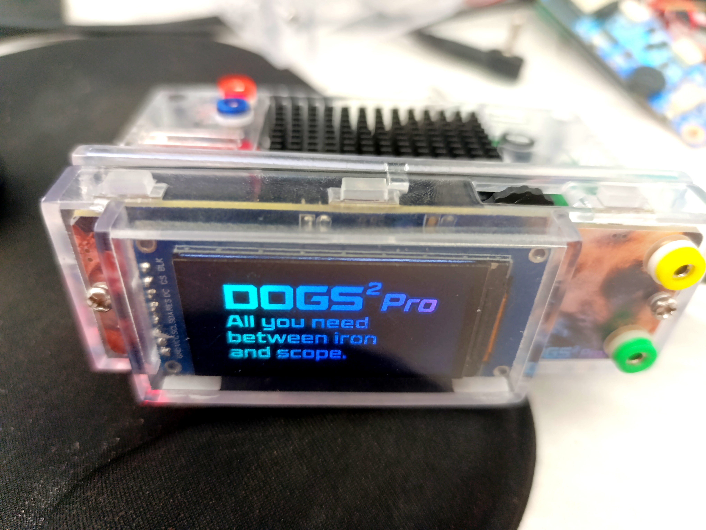
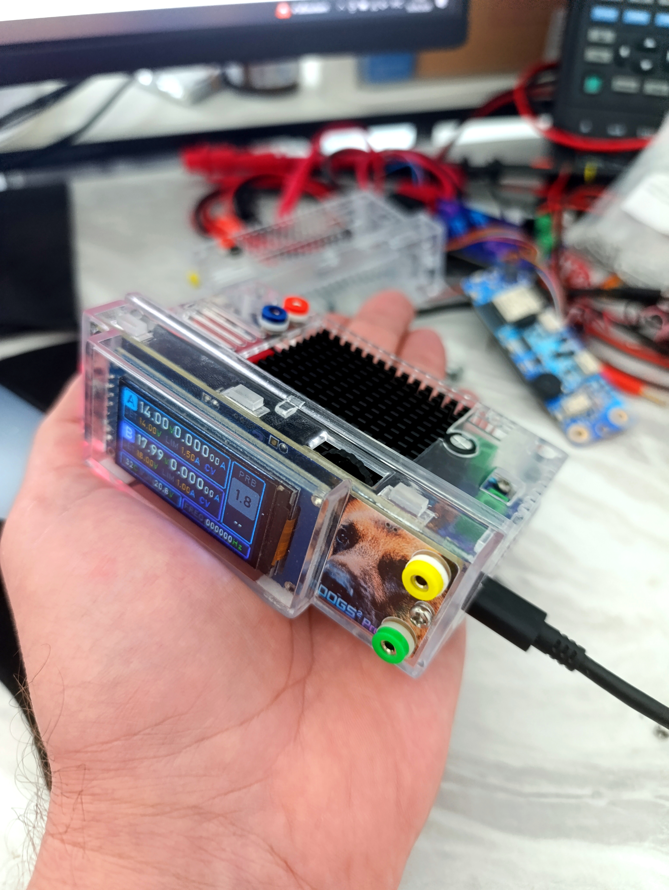
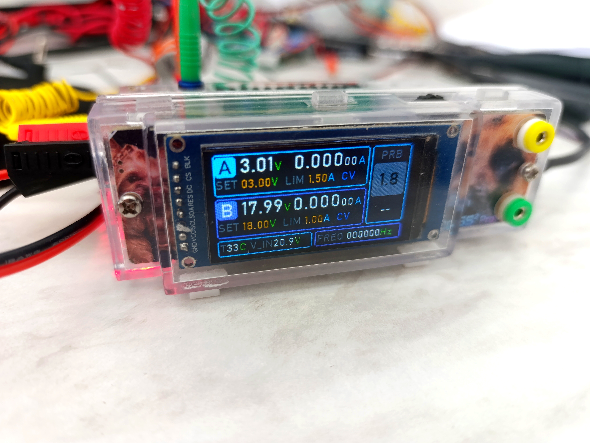
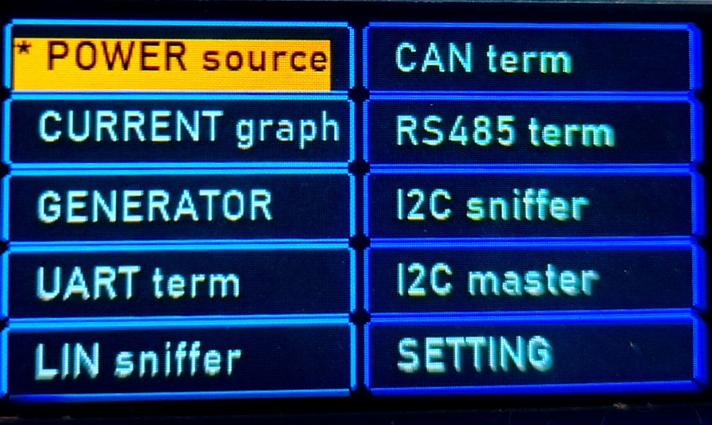
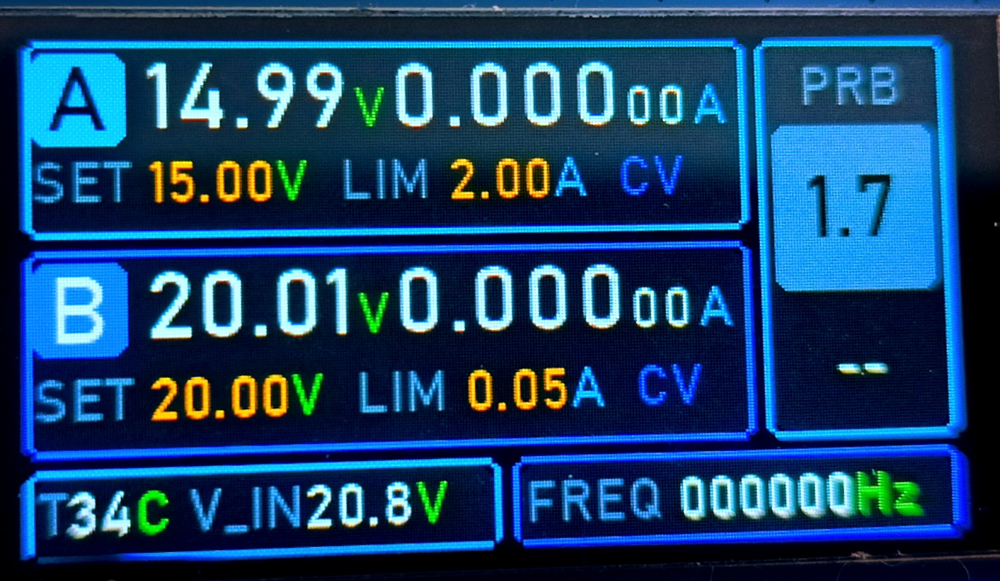
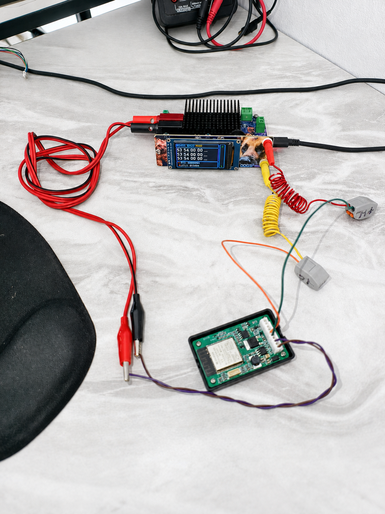
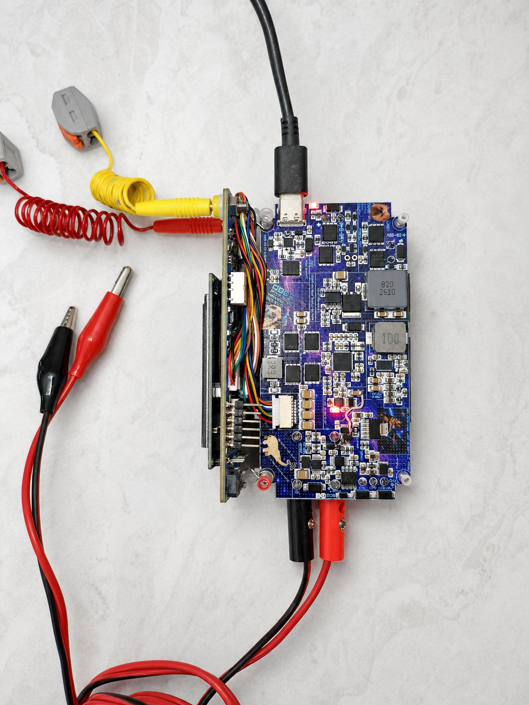
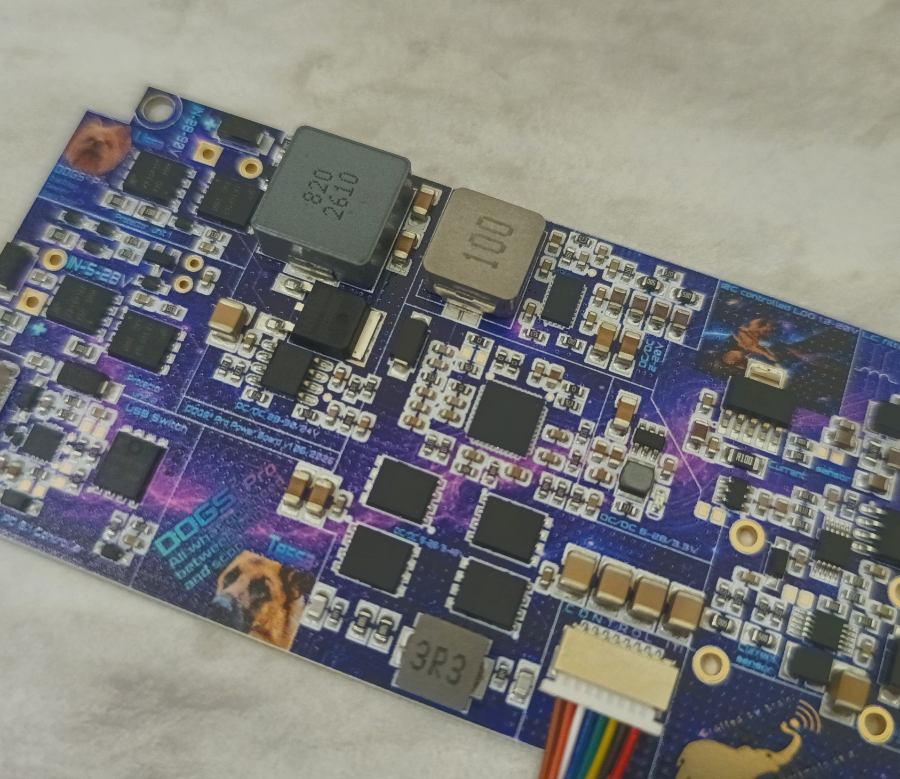
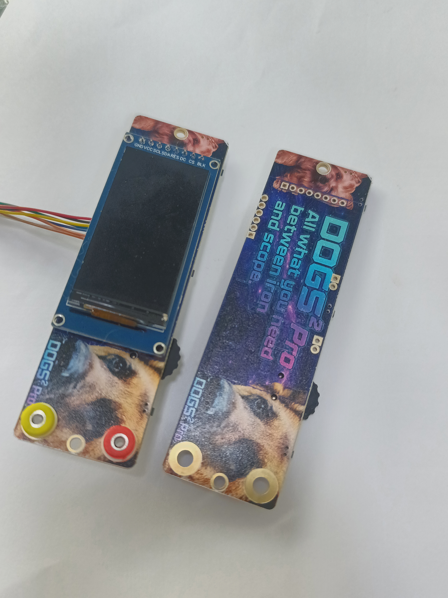
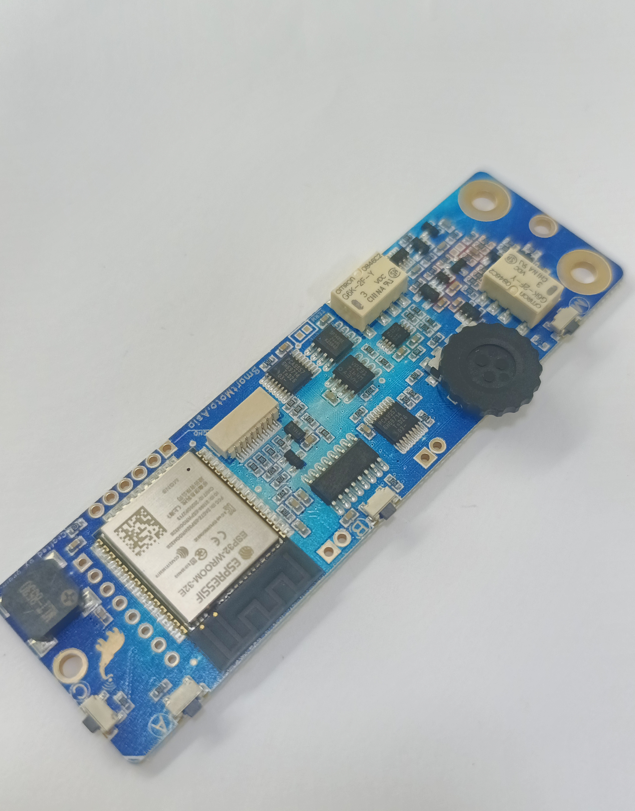

# DOGS²

**DOGS² (Dual Output Generator Supply Station)** is an open-source, standalone
board bring-up station. It combines two programmable power outputs, current and
voltage monitoring, a signal generator, and common embedded-interface tools in
one compact instrument.

  

  

- DC/DC power channel 1-48V / 5A peak with CV/CC operation, 50 uA current resolution;
- LDO power channel 1.3-20V / 2A peak with CV/CC operation, 12.5 uA current resolution;
- actual values voltage and current monitoring;
- current graphics on display and phone app
- square-wave generator;
- UART and RS485 terminal modes;
- CAN receive, filtering, and transmission;
- LIN bus sniffer;
- I2C sniffer and I2C master terminal;
- analog probe and frequency meter input;
- standalone TFT display, encoder, and front-panel controls;
- Bluetooth SPP command and telemetry (current graph) connection.

  <strong><a href="https://dogs2.smartmoto.asia">Visit the DOGS² project website</a></strong> 
  Project overview, beta-testing signup, and launch updates 
  <a href="https://hackaday.io/project/206311-dogs-dual-output-generator-supply-station">Follow the development logs on Hackaday.io</a>

This repository documents the current **v1 engineering samples**. The hardware
works and the firmware is under active development and tuning; published limits
and accuracy figures should therefore be treated as engineering-sample data,
not final product specifications.

## Project status

Five v1 engineering samples have been assembled. Hardware characterization,
firmware development, documentation, preparation for
external beta testing are ongoing.

**Want to follow or test DOGS²?** Visit the
[project website](https://dogs2.smartmoto.asia) for the overview and beta-test
signup, and follow the
[development logs on Hackaday.io](https://hackaday.io/project/206311-dogs-dual-output-generator-supply-station)
for build updates, tests, limitations, and design progress.

## Repository structure

| Directory | Contents |
|---|---|
| [`hardware/`](hardware/) | Schematics, block diagram, editable design archive, PCB manufacturing files, BOMs, renders, and hardware known issues |
| [`mechanical/`](mechanical/) | Mechanical-design status and future enclosure files |
| [`software/`](software/) | Current ESP32 firmware, build configuration, tools, software documentation, and software known issues |

## Current capabilities

  

## Working hardware

<table>
  <tr>
    <td width="33%">
      
    </td>
    <td width="33%">
      
    </td>
    <td width="33%">
      
    </td>
  </tr>
  <tr>
    <td align="center">v1 engineering prototype</td>
    <td align="center">Signal generator</td>
    <td align="center">RS485 test</td>
  </tr>
</table>

<table>
  <tr>
    <td width="25%">
      
    </td>
    <td width="25%">
      
    </td>
    <td width="25%">
      
    </td>
    <td width="25%">
      
    </td>
  </tr>
  <tr>
    <td align="center">Assembled prototype — bottom view</td>
    <td align="center">Power board — top-angle close-up</td>
  </tr>
</table>

## Documentation map

- Hardware overview: [`hardware/README.md`](hardware/README.md)
- Hardware schematics: [`hardware/schematic/`](hardware/schematic/)
- Firmware overview: [`software/README.md`](software/README.md)

## Licensing

The v1 hardware design is licensed under
[CERN-OHL-W-2.0](hardware/LICENSE). The firmware and software tools in
[`software/`](software/) are licensed under the
[GNU General Public License v3.0 only](software/LICENSE) (`GPL-3.0-only`).

  <strong>
    <a href="https://dogs2.smartmoto.asia">Visit the DOGS² project website</a>
    ·
    <a href="https://hackaday.io/project/206311-dogs-dual-output-generator-supply-station">Follow DOGS² on Hackaday.io</a>
  </strong>

