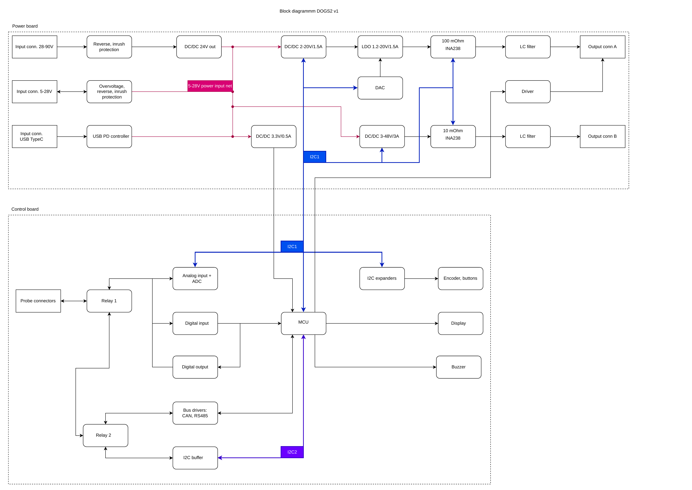
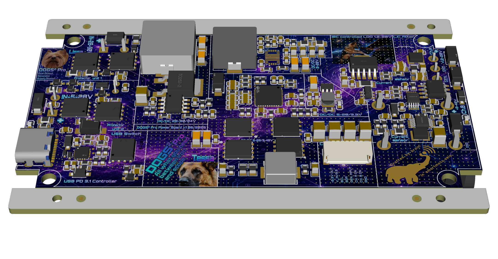
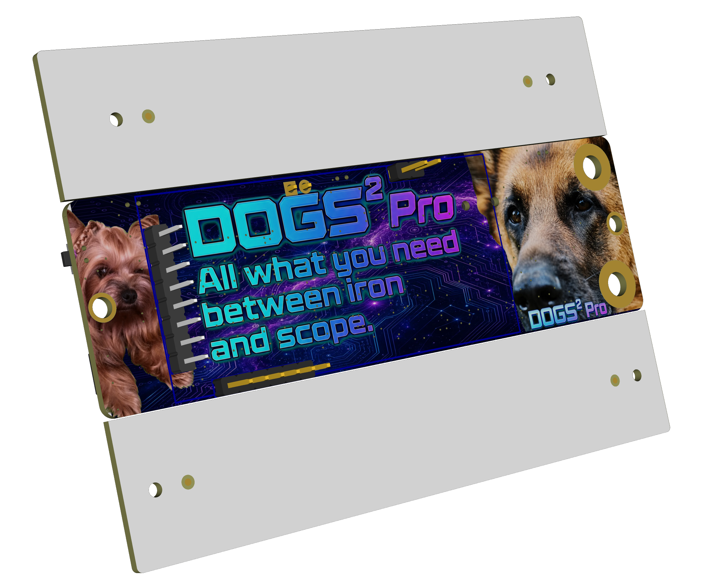

# DOGS² v1 hardware

This directory contains the source, reference, and manufacturing files for the
current **DOGS² v1 engineering sample**.

Parameters are still being tuned and verified. The files describe the boards
that were built; they are not yet a production release.

## System architecture

The diagram separates the power board from the control board and shows the
power paths, two programmable outputs, measurements, processor, controls, probe
connections, and digital-interface drivers.

- [View the block diagram as PDF](schematic/DOGS2_v1_block_diagram.pdf)
- [View the complete schematic](schematic/DOGS2_v1_schematic.pdf)

## Board renders

<table>
  <tr>
    <td width="50%">
      
    </td>
    <td width="50%">
      
    </td>
  </tr>
  <tr>
    <td align="center">Power board render</td>
    <td align="center">Control panel render</td>
  </tr>
</table>

## Directory contents

### `design/`

| File | Purpose |
|---|---|
| `DOGS2_v1_easyeda_project.zip` | Complete editable EasyEDA project archive |

### `schematic/`

| File | Purpose |
|---|---|
| `DOGS2_v1_block_diagram.pdf` | Publication-quality system block diagram |
| `DOGS2_v1_block_diagram.png` | GitHub preview generated from the block-diagram PDF |
| `DOGS2_v1_schematic.pdf` | Power-board and control-panel schematics |

### `manufacturing/`

- `control_panel/`: Gerbers, BOM, and pick-and-place data for the control panel.
- `power_board/`: Gerbers, BOM, and pick-and-place data for the power board.
- `DOGS2_v1_system_bom.xlsx`: system-level BOM for boards, display, enclosure
  parts, and purchased items.

### `renders/`

Top/bottom power-board and front/rear control-panel renders.

## Revision and manufacture

All files in this directory belong to hardware revision **v1**. Before ordering
boards, read [`KNOWN_ISSUES.md`](KNOWN_ISSUES.md). Manufacturing parameters
have intentionally not been prescribed here: use the requirements contained in
the Gerber packages and confirm them with the chosen PCB assembler.

## License

The DOGS² v1 hardware design files are licensed under the
**CERN Open Hardware Licence Version 2 - Weakly Reciprocal
(CERN-OHL-W-2.0)**. See [`LICENSE`](LICENSE).
