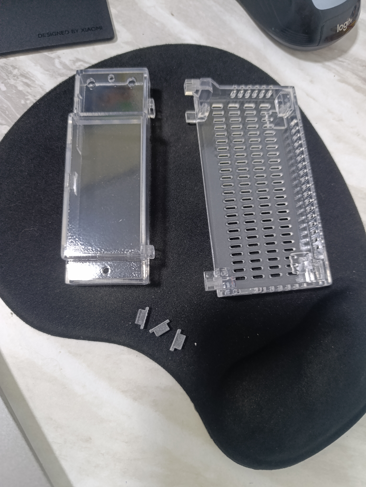

# DOGS² mechanical design

This directory contains the STEP files for the current DOGS² v1 enclosure.
The enclosure consists of one front panel, one base, and three identical
buttons.

## Known issues

Two 2.3 mm holes need to be drilled for the 2.6*16 self-tapping screws securing the top cover.
The protrusion on the lower part of the enclosure above the USB connector opening needs to be filed down in the area where it prevents the top cover from being installed.

## Enclosure parts

| File | Part | Quantity |
|---|---|---:|
| [`Front_v1_final_1.step`](Front_v1_final_1.step) | Front panel | 1 |
| [`Bottom_v1_final_1.step`](Bottom_v1_final_1.step) | Enclosure base | 1 |
| [`Button_v1_x3_final_1.step`](Button_v1_x3_final_1.step) | Front-panel button | 3 |

## Fabricated parts

  

These files document the enclosure fitted to the current v1 engineering
hardware. Minor mechanical refinements may still be made as testing continues.

The current hardware package and system BOM are available in
[`../hardware/`](../hardware/).
